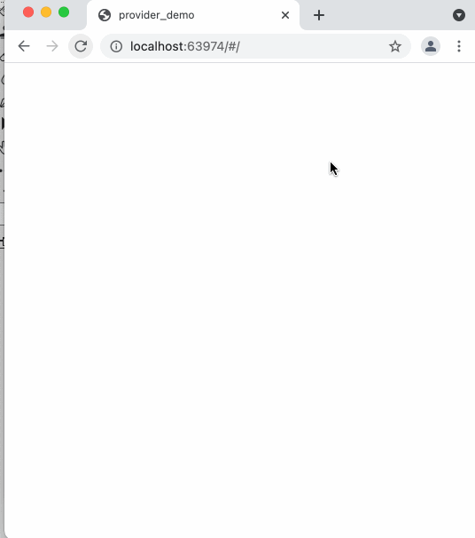

# provider_demo

A Flutter Provider Code Test

## Getting Started

`lib/main.dart` contains the boilerplate required to replicate this app behavior:

All you need to do is fill in the blanks.

1. Fill out the `CartItem` class. Give it properties and methods in order to function.
1. Finish the `CartState` class which extends `ChangeNotifier`. The blank methods are all you need to build a Provider to the main App.
1. `MyCartApp` is pretty much good as it is. Under normal circumstances, you shouldn't need to modify anything here.
1. Complete the `CartControls` widget class. There are widgets in here which call their respective onPressHandlers. Complete the code in the onPressHanders.
1. Complete the `ListOfCartItems` widget class. Provide a view for when the cart is empty. Provide three widgets which show a cart item's name, and two controls which will increment and decrement the quantity of each item in the cart.
1. Complete `CartSummary`. While it's not missing anything, It's pretty boring. Set it apart from the remaining widgets.

### You know you've succeeded when:

1. Adding an item to the cart displays a new cart line item, AND increments the total cart contents.
1. Incrementing or decrementing an item's quantity updates that item's line item label, AND updates the the total items in the cart display.

### You will be evaluated on:
1. Finding the right balance between elegance and efficiency
1. Documenting your code when something isn't clear
1. Linting and formatting
1. Any innovative or creative ideas you have.

### What if I don't finish?
Don't worry about not being able to finish. As a guide, this shouldn't take more than 2 hours. If things happen where it's taking longer, consider some bonus points, and also be prepared to talk about your thought process during the interview. We're more interested about your approach than about your completeness.

### Bonus points:

1. This is a pretty bare-bones app. Consider adding an app-wide theme, and controlling the style and colour of UI elements with that theme. 
1. The designer neglected to create a button for deleting an item from the cart. How would you handle this, _within_ the current confines of the design? (Hint: don't create a new button for this... there must be _some_ set of conditions where an item is removed from the cart as the user would expect it to.)
1. We should probably do some tests, so that new features in the future won't break existing functionality.